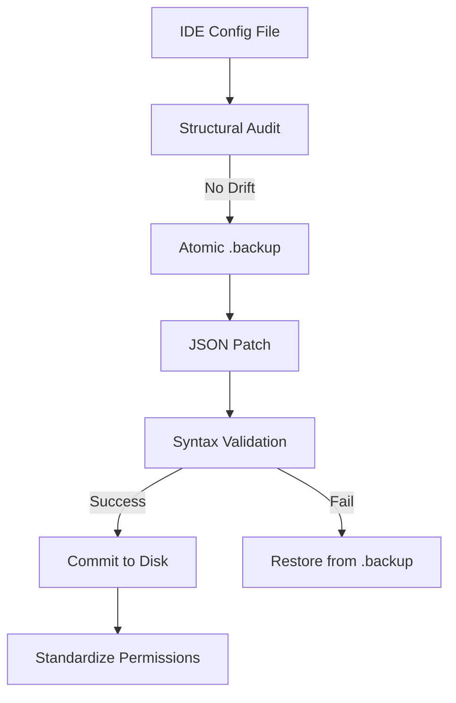

# Features & Capabilities: The Surgeon (mcp-injector)

**Precision Configuration Injection for the Workforce Nexus.**

The Surgeon is the configuration bridge between high-level AI tools and low-level IDE settings. This document provides a high-density reference for all operational modes, safety protocols, and Nexus integration logic.

---

## 📊 Capability Matrix

| Feature | Description | Lite Mode | Permanent Mode |
| :--- | :--- | :---: | :---: |
| **JSON Injection** | Add/Remove servers without bracket hell | Basic | Full Validation |
| **Structural Audit** | Detects schema drift in IDE configs | N/A | Supported |
| **Backups** | Atomic `.backup` creation before writes | ✅ | ✅ |
| **Client Detection** | Auto-locates Claude, Cursor, Xcode, etc. | ✅ | ✅ |
| **Auto-Chmod** | Sets execute bits on injected scripts | ✅ | ✅ |

---

## 📋 Table of Contents
1. [Safety Architecture](#safety-architecture)
2. [Command Matrix](#command-matrix)
3. [Reliability Tiers](#reliability-tiers)
4. [Nexus Integration](#nexus-integration)

---

## 🔍 Safety Architecture

The Surgeon follows a strict **Verify -> Backup -> Change -> Validate** loop.

---

## 💻 Command Matrix (Lookup)

| Operation | Command | Primary Flag | Context |
| :--- | :--- | :--- | :--- |
| **Add (Wizard)** | `python mcp_injector.py --add` | `--client claude` | Guided server setup |
| **Add (Direct)**| `python mcp_injector.py --add` | `--name X --command Y` | Scripted/Installer mode |
| **Remove** | `python mcp_injector.py --remove`| `--name server-name` | Safe subtraction |
| **List Config** | `python mcp_injector.py --list` | `--client cursor` | Inspect IDE state |
| **List Clients** | `python mcp_injector.py --list-clients` | N/A | Discovery mode |
| **Audit** | `python mcp_injector.py --check` | N/A | Schema integrity check |

---

## 📊 Reliability Tiers

Performance and validation scale with your **Nexus Reliability Tier**.

*   **Basic**: Standard JSON manipulation with atomic backup. 
*   **High**: **Structural Auditing** enabled. Matches the IDE's internal mirror to detect manual config drift.
*   **Industrial**: **Full JSON Schema Validation** via `jsonschema`. Guarantees maximum compliance with IDE expectations.

---

## 🔐 Universal Safety & Hardening
*   **Bracket Hell Prevention**: Automated comma and list management ensures zero syntax errors.
*   **Permissions Hardening**: Automatically runs `chmod +x` on any shell or python scripts injected into a config.
*   **Atomic Transactions**: Uses temporary file swaps to ensure configurations are never corrupted during power loss.

---

> **Author**: l00p3rl00p / Workforce Nexus
> **Reference**: [NEXUS_TECHNICAL_SPEC.md](../repo-mcp-packager/NEXUS_TECHNICAL_SPEC.md)

## 🏢 The Nexus Convergence Model
The Surgeon supports three tiers of organizational binding:

| Feature | Lite (Loose Binding) | Standard (Close Binding) | Industrial (Managed App) |
| :--- | :--- | :--- | :--- |
| **Logic Area** | Repos remain in workspace | `~/.mcp-tools/suite` (Symlinks) | `~/.mcp-tools/app` (Managed) |
| **Environment** | OS-Default / Manual | Per-module venvs | Unified Hardened Venv |
| **Update Path** | Manual per repo | Live (via Symlinks) | On-Demand (`nexus-sync`) |

---

## 📚 Master Documentation
For the complete suite experience and detailed procedures, see:
👉 **[NEXUS_GUIDE.md](../repo-mcp-packager/NEXUS_GUIDE.md)**

---

> **Author**: l00p3rl00p / Workforce Nexus
> **Reference**: [ARCHITECTURE.md](./ARCHITECTURE.md) | [ENVIRONMENT.md](./ENVIRONMENT.md)

