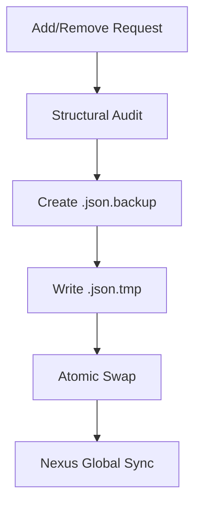
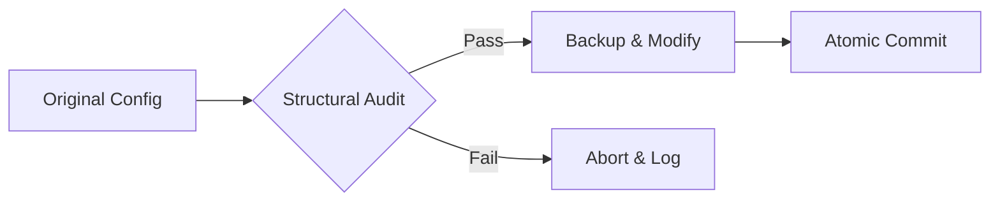

# MCP Workforce Nexus: The Surgeon (mcp-injector)

**Precision JSON configuration injection with industrial-grade safety and atomic reliability.**

The **Surgeon** is a specialized tool for safely modifying IDE configuration files (Claude Desktop, Cursor, VS Code, etc.) to inject or remove MCP server definitions without breaking syntax.

---

## ⚡ Quick Start: Standalone Surgeon

Inject a server into your Claude Desktop config immediately:

```bash
python3 mcp_injector.py add claude my-server "python3 path/to/server.py"
```
*Selection tip: Use `add` for injection and `remove` for surgical extraction.*

---

## 🚀 Package Start: The Workforce Nexus

The Surgeon is a core member of the Workforce Nexus. When used as part of the suite, it automatically synchronizes IDE paths to the central Observer.

```bash
# In the suite, standalone usage remains the same, but benefits from Nexus venv
~/.mcp-tools/mcp-injector/mcp_injector_install.sh add cursor my-tool "node index.js"
```

---

## 📋 Table of Contents
1. [Surgical Flow](#surgical-flow)
2. [Reliability Layer Matrix](#reliability-layer-matrix)
3. [Core Capabilities](#core-capabilities)
4. [Universal Safety & Backups](#universal-safety--backups)
5. [Documentation (Low Density)](#documentation-low-density)

---

## 🔍 Surgical Flow

The Surgeon ensures that your configuration is never corrupted by following a strict validation loop.



---

## 📊 Reliability Layer Matrix

The Surgeon unifies safety protocols across all execution tiers.

| Tier | Protection | Confidence | Mechanism |
| :--- | :--- | :---: | :--- |
| **Basic** | Atomic Write | **Standard** | `.tmp` file validation before swap |
| **High** | Structural Audit | **Advanced** | Type-drift detection (Schema Drift) |
| **Industrial** | Schema Validation | **Industrial** | `jsonschema` enforcement |

---

## 🌟 Core Capabilities

*   **Surgical Injection**: Adds or updates `mcpServers` entries without touching existing configurations.
*   **Structural Audit**: Prevents overwriting if the JSON schema has changed unexpectedly.
*   **Suite Synergy**: Automatically registers managed IDE configs in `~/.mcp-tools` for Librarian discovery.
*   **Nexus Global Sync**: Ensuring all IDE modifications are tracked centrally.
*   **Interactive Mode**: Use `python3 mcp_injector.py interactive` for a guided experience.
*   **Multilingual Support**: Handles Python, Node.js, and Shell scripts with automatic path resolution.


# Application Convergence & Synergy
The "Nexus Application" mode is triggered when the bootstrapper detects all four modules (mcp-injector, mcp-link-library, mcp-server-manager, repo-mcp-packager) in the same workspace.

Convergence Matrix (Organization & Areas)
Feature	Lite (Loose Binding)	Standard (Close Binding)	Industrial (Managed App)
Philosophy	"Distributed & Portable"	"Cohesive & Linked"	"Monolithic & Hardened"
Logic Area	Repos remain in workspace	~/.mcp-tools/suite (Symlinks)	~/.mcp-tools/app (Managed Mirror)
Shared Base	~/.mcp-tools/lite/	~/.mcp-tools/standard/	~/.mcp-tools/industrial/
Environment	OS-Default / Manual Venv	Per-module local venvs	Single Unified Hardened Venv
Update Path	Manual per repo	Live (via Symlinks)	On-Demand (nexus-sync)
Global Path	Optional (Local first)	Recommended	Mandatory Enforcement


---

## 🔐 Universal Safety & Backups

Every modification creates a timestamped or `.backup` file. If the final write fails, the original config is untouched.



---

## 🛠️ Nexus Command Reference (Surgeon Context)

| Tool | Shared Command | Direct Module Execution |
| :--- | :--- | :--- |
| **Surgeon** | `mcp-surgeon` | `python3 mcp_injector.py` |
| **Activator** | `mcp-activator` | `python3 bootstrap.py` |

---

## 🖥️ GUI Management (Quick Ref)
*   **Launch Dashboard:** `mcp-observer gui`
*   **Stop:** `Ctrl + C` in the terminal.
*   **URL:** [http://localhost:8501](http://localhost:8501)

---

## 📚 Master Documentation
For the complete suite experience and detailed procedures, see:
👉 **[NEXUS_GUIDE.md](../repo-mcp-packager/NEXUS_GUIDE.md)**

---

## 📚 Documentation (Low Density Deep Dives)

Detailed technical manuals for engineering reference:

*   **[ARCHITECTURE.md](./ARCHITECTURE.md)**: Logic models, subsystems, and the injection engine.
*   **[ENVIRONMENT.md](./ENVIRONMENT.md)**: IDE config paths, OS mapping, and dependency rules.
*   **[FEATURES.md](./FEATURES.md)**: Command matrix, interactive menu, and feature scoring.

---

## 📝 Metadata
*   **Status**: Hardened (Phase 9)
*   **Author**: l00p3rl00p
*   **Workflow**: Adheres to `@/fix-md-files-for-release`
